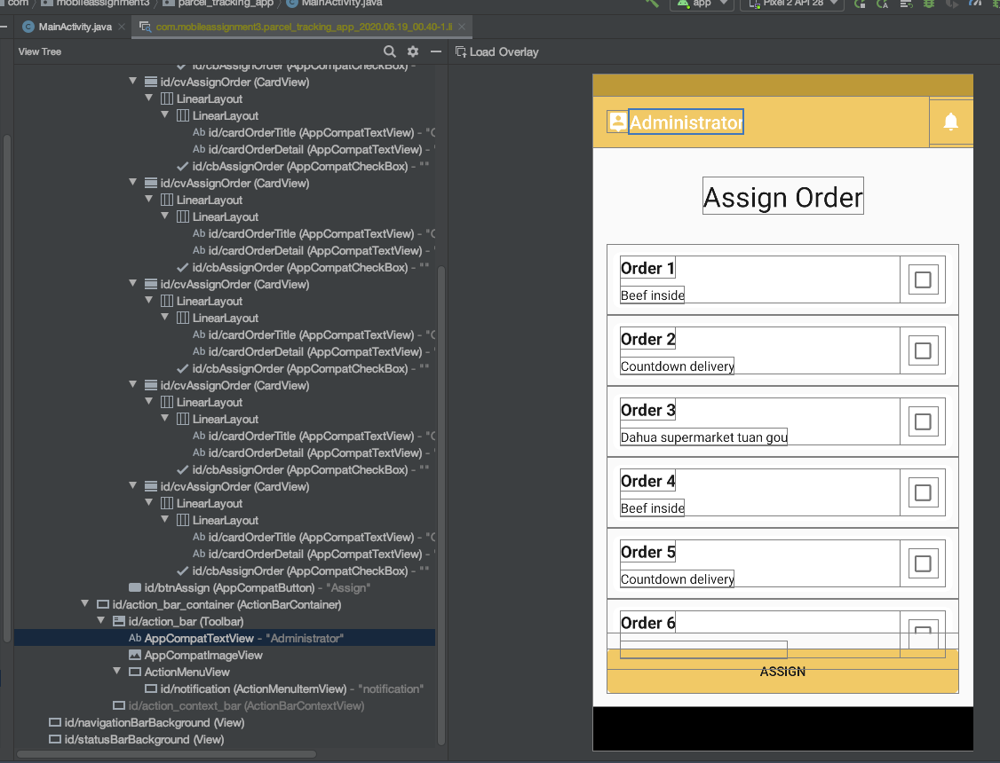

## Date: 15/06/2020

**Time Taken**: 2 hours

**Done**: Splash screen

---

### Useful Links

[How to Make Splash Screen in Android](https://hackernoon.com/how-to-make-splash-screen-in-android-e8333yoq)

[Android Hide Title Bar and Full Screen Example](https://www.javatpoint.com/android-hide-title-bar-example)

### Step

1. Create a new `activity` for `splash activity`

2. Change launching `activity` with `splash activity`:

   Go to  `manifest.xml`, change the `<intent-filter>...</intent-filter>` to splash activity
  
        ```java
        <activity android:name=".SplashActivity">
            <intent-filter>
                <action android:name="android.intent.action.MAIN" />
                <category android:name="android.intent.category.LAUNCHER" />
            </intent-filter>
        </activity>
        <activity android:name=".MainActivity">
        </activity>
        ```
3. Design the `splash activiy`

4. Add a timer that will trigger next activity

    ```java
    public class SplashActivity extends AppCompatActivity {
    
        @Override
        protected void onCreate(Bundle savedInstanceState) {
            super.onCreate(savedInstanceState);
            setContentView(R.layout.activity_splash_screen);
          
            new Handler().postDelayed(new Runnable() {
                @Override
                public void run() {
                    startActivity(new Intent(SplashActivity.this, MainActivity.class));
                    finish();
                }
            }, 2000); //means 2 seconds
        }
    }
    ```

5. Hide Title Bar and Full Screen, add the code to `onCreate` function (`requestFeature()` must be called before adding content)
    
    ```java
    //add before ContentView(...)
    //will hide the title
    requestWindowFeature(Window.FEATURE_NO_TITLE);
    //hide the title bar
    getSupportActionBar().hide(); 
    //show the activity in full screen
    this.getWindow().setFlags(WindowManager.LayoutParams.FLAG_FULLSCREEN,WindowManager.LayoutParams.FLAG_FULLSCREEN); 
    ```
    
### Can Be Improved

1. The transition animation of the two activities

## Date: 16/06/2020

**Time Taken**: 2 hours

**Done**: Clour theme design, Login UI

---

### Useful Links

[Material Design Color Tool](https://material.io/resources/color/#!/?view.left=0&view.right=0&primary.color=ffc75f&secondary.color=E57373)

[Material Theming](https://material.io/design/material-theming/overview.html)

[ColorSpace](https://mycolor.space/?hex=%23FFC75F&sub=1)

## Date: 17/06/2020

**Time Taken**: 2 hours

**Done**: Signup UI

---

### Useful Links

[TabLayout Tutorial With Example In Android Studio](https://abhiandroid.com/materialdesign/tablayout-example-android-studio.html#Example_2_of_TabLayout_Using_ViewPager)

[Create swipe views with tabs using ViewPager](https://developer.android.com/guide/navigation/navigation-swipe-view#java)

### Create TabLayout Setps

1. In `activity.xml`

    ```java
    <androidx.viewpager.widget.ViewPager
        xmlns:android="http://schemas.android.com/apk/res/android"
        android:id="@+id/pager"
        android:layout_weight="1"
        android:layout_width="match_parent"
        android:layout_height="0dp">
    
        <com.google.android.material.tabs.TabLayout
            android:id="@+id/tab_layout"
            android:background="@color/colorPrimaryLight"
            android:layout_width="match_parent"
            android:layout_height="wrap_content" />
    
    </androidx.viewpager.widget.ViewPager>
    ```
    
2. In `activity.java` setup pager

3. Create fragment

## Date: 17/06/2020

**Time Taken**: 1 hours

**Done**: Administrator main UI, Driver main UI, Receiver main UI

---

### Useful Links

[How to set title for action bar in android?](https://www.tutorialspoint.com/how-to-set-title-for-action-bar-in-android)

### Can Be Improved

1. Add `notification button` in action bar

2. Add `profile button` in action bar

## Date: 17/06/2020

**Time Taken**: 4 hours

**Done**: Create Recyclerview and Cardview

---

### Useful Links

[Create a List with RecyclerView](https://developer.android.com/guide/topics/ui/layout/recyclerview)

[Android RecyclerView, Android CardView Example Tutorial](https://www.journaldev.com/10024/android-recyclerview-android-cardview-example-tutorial)

[Create a Card-Based Layout](https://developer.android.com/guide/topics/ui/layout/cardview)

### Step

1. Open the build.gradle file for app module  

2. Add the support library to the dependencies section
    
    ```java
    dependencies {
        ...
        implementation 'androidx.recyclerview:recyclerview:1.0.0'
    }
    ```

3. Add RecyclerView to layout

    ```xml
    <?xml version="1.0" encoding="utf-8"?>
    <!-- A RecyclerView with some commonly used attributes -->
     <androidx.recyclerview.widget.RecyclerView
        android:id="@+id/my_recycler_view"
        android:scrollbars="vertical"
        android:layout_width="match_parent"
        android:layout_height="match_parent"/>
    ```
4. Add CardView to a new layout (design the card content structure)

    ```xml
    <?xml version="1.0" encoding="utf-8"?>
    <androidx.cardview.widget.CardView
    ...>
    
        <LinearLayout
        ...>
    
            <TextView
                ...>
    
            <TextView
                ...>
    
        </LinearLayout>
    
    </androidx.cardview.widget.CardView>
    ```

5. Go to activity.java, obtain a handle to the object, connect it to a layout manager, and attach an adapter for the data to be displayed.

6. Add a list adapter in activity.java

## Date: 18/06/2020

**Time Taken**: 4 hours

**Done**: Create Notification UI and My Account UI

---

### 1. Change the action bar title and logo icon

In the `onCreate()` function:

```java
  // Change the actionbar title and icon
        getSupportActionBar().setDisplayShowHomeEnabled(true);
        getSupportActionBar().setLogo(R.drawable.ic_person_pin_black_24dp);
        getSupportActionBar().setDisplayUseLogoEnabled(true);
        getSupportActionBar().setTitle("Administrator");
```

> <https://stackoverflow.com/questions/14483393/how-do-i-change-the-android-actionbar-title-and-icon>

### 2. Create action bar menu

> <https://www.journaldev.com/9357/android-actionbar-example-tutorial>

1. Create menu XML resource file in res/menu folder
    
    ```java
    <menu xmlns:android="https://schemas.android.com/apk/res/android"
        xmlns:app="https://schemas.android.com/apk/res-auto"
        xmlns:tools="https://schemas.android.com/tools" tools:context=".MainActivity">
        
        <item
            android:id="@+id/add" android:icon="@android:drawable/ic_menu_add" app:showAsAction="always"   android:title="@string/add"/>
        <item
            android:id="@+id/reset" android:icon="@android:drawable/ic_menu_revert" app:showAsAction="always|withText" android:title="@string/reset"/>
        <item
            android:id="@+id/about" android:icon="@android:drawable/ic_dialog_info" app:showAsAction="never" android:title="@string/about">
        </item>
        <item
            android:id="@+id/exit"  app:showAsAction="never" android:title="@string/exit">
        </item>
    </menu>
    ```

2. In MainActivity.java, in the MainActivity Class:

    ```java
    public class MainActivity extends AppCompatActivity {
    
        ...
        @Override
        protected void onCreate(Bundle savedInstanceState) {
            ...
        }
    
        @Override
        public boolean onCreateOptionsMenu(Menu menu) {
            // Inflate the menu; this adds items to the action bar if it is present.
            getMenuInflater().inflate(R.menu.menu_main, menu);
            return true;
        }
    
        @Override
        public boolean onOptionsItemSelected(MenuItem item) { switch(item.getItemId()) {
            case R.id.add:
                count=(TextView)findViewById(R.id.textView);
                count.setText("Add is clicked");
                return(true);
            case R.id.reset:
                count=(TextView)findViewById(R.id.textView);
                count.setText("Nothing is selected");
                return(true);
            case R.id.about:
                Toast.makeText(this, R.string.about_toast, Toast.LENGTH_LONG).show();
                return(true);
            case R.id.exit:
                finish();
                return(true);
    
        }
            return(super.onOptionsItemSelected(item));
        }
    }
    ```

### 3. Set OnClick Listener on Action Bar Title

> <https://stackoverflow.com/questions/24838155/set-onclick-listener-on-action-bar-title-in-android>

1. Find the action bar title id

    Open the activity in emulator, Click on `Tools >>>> Layout Inspector`, in the open window, select the activity which has the action bar, in the open window can see every item of that activity with details, like `id`
    
    
    
    
    

2. In the MainActivity, in the `OnCreate()` function:

    ```java
    // Click the action bar title to open the profile activity
    findViewById(R.id.action_bar).setOnClickListener(new View.OnClickListener() {
        @Override
        public void onClick(View v) {
            Intent myIntent = new Intent(MainActivity.this, ProfileActivity.class);
            startActivity(myIntent);
        }
    });
    ```

### 4. Use the build in Icon

Click on `File >>>> New >>>> Vector Asset`, can select the icon and it will be added into the `res/drawable`


## Date: 18/06/2020

**Time Taken**: 1 hours

**Done**: Discussion Class Diagram

---

1.1 administrator, driver, receiver all have the same attribute as the user: username, email, password

1.2 user has a group/role attribute: administrator/receiver/driver

1.3 delivery attribute(basic, necessary): delivery address, receiver, status, assugned driver, tracking number

1.4 delivery status(the name used is only for explanation, you can change the better name): ready_to_delivery_today, out_for_delivery, on_the_way, delivered

2.1 administrator function: get(delivery.ready_to_delivery_today), assign(delivery.ready_to_delivery_today)

2.2 after the administrator assign the delivery, the delivery status change to 'out_for_delivery'

3.1 driver function: get(delivery.assigned_to_me), sendMessage(delivery_of_the_receiver,receiver, estimated_time)

3.2 after the driver send the delivery message to the receiver, the delivery status change to 'on_the_way'

4.1 receiver function: get(delivery.receiver_is_me),
receiveMessage(when mine delivery will come to me),
view(tracking_delivery),
confirm(receive_the_delivery)

4.2 after the receiver confirm the delivery, the delivery status change to 'delivered'


## Date: 19/06/2020

**Time Taken**: 1 hours

**Done**: Logo design

---

### Useful Links

[FreeLogoDesign](https://www.freelogodesign.org/)


## Date: 23/06/2020

**Time Taken**: 2 hours

**Done**: Google Map Directions API

---

### Useful Links

[Google Maps Platform Web Services Directions API](https://developers.google.com/maps/documentation/directions/start)

[Android GoogleMap Example to Draw Route Between Two Locations](https://c1ctech.com/android-googlemap-example-to-draw-route-between-two-locations/)

## Date: 24/06/2020

**Time Taken**: 0.5 hour

**Done**: Logout and clear current Activity stack and launch a new Activity

---

### Useful Links

[Clear your current Activity stack and launch a new Activity](https://riptutorial.com/android/example/17590/clear-your-current-activity-stack-and-launch-a-new-activity)

If want to clear current Activity stack and launch a new Activity (for example, logging out of the app and launching a log in Activity), there appears to be two approaches.

1. Target (API >= 16)

Calling `finishAffinity()` from an Activity

2. Target (11 <= API < 16)

```java
Intent intent = new Intent(this, LoginActivity.class);
intent.setFlags(Intent.FLAG_ACTIVITY_NEW_TASK | Intent.FLAG_ACTIVITY_CLEAR_TASK |Intent.FLAG_ACTIVITY_CLEAR_TOP);
startActivity(intent);
finish();
```

